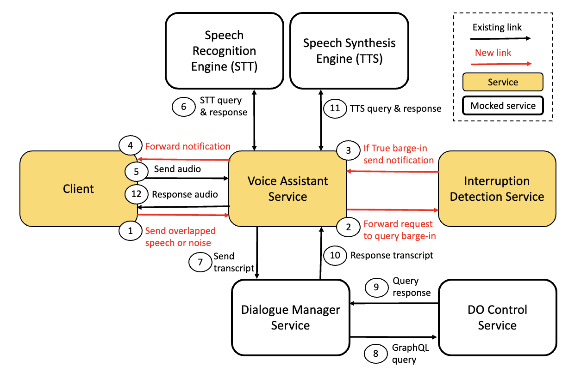

# DO-voicebot
Imperial College London Data Observatory Voice Assistant with Barge-in Detection service integrated. As displayed in the diagram below, we mock non-core services. The mocking is performed through 'dummy' functions in the Voice Assistant service.  The numbered steps in the diagram represent the control flow of handling a True barge-in from the moment overlapped user speech is detected



## Set-up

### 1. Barge-in Detection service

First navigate to the barge_in_detection_service folder to spin up the Docker container with commands:

```
docker build -t barge-in-service-img .
```

```
docker run -d -p 8080:8080 barge-in-service-img
```

This binds the service to port 8080

Or alternatively we can run this locally by pip installing the contents of the requirements.txt and running the command:
```
hypercorn app:app --keep-alive 10000 --bind 0.0.0.0:8080
```

### 2. Voice Assistant service

To run locally, navigate to the voice_assistant_service directory and run:

```
npm run start
```

This will set up the service and it will be listening at port 2000.

### 3. Client

Navigate to the voice_assistant_service directory and run:

```
npm run start
```

This sets the client up at port 6060, which you can access with your browser.

# Barge-in Detection service

## Run locally and test

Firstly, we must pip installing the contents of the requirements.txt.

Following this we need to set our starting variables in app.py before running locally. Update the AVERAGE_MODEL_WEIGHTS_PATH and PATTERN_MODEL_WEIGHTS_PATH variables to the absolute path where the model weights are. Then set the LOCAL variable to True.

Now by running the following we can run the service locally:

```
hypercorn app:app --keep-alive 10000 --bind 0.0.0.0:8080
```

Or should we want to test we can run:

```
python3 tests.py
```

Ensure that both of the above commands are run from inside the barge_in_detection_service directory.